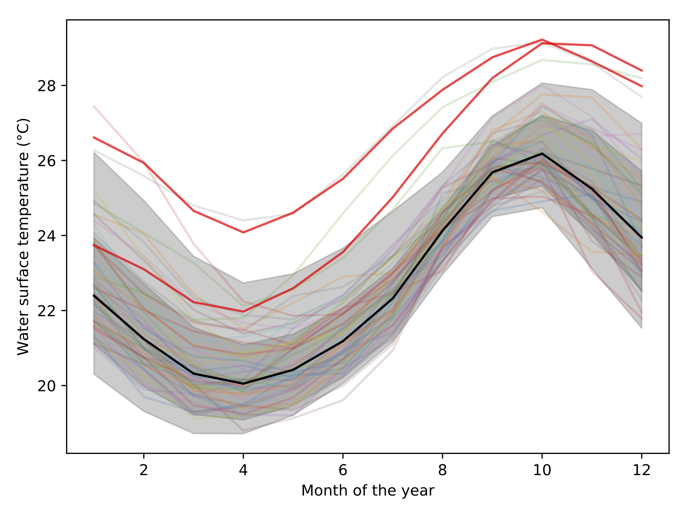
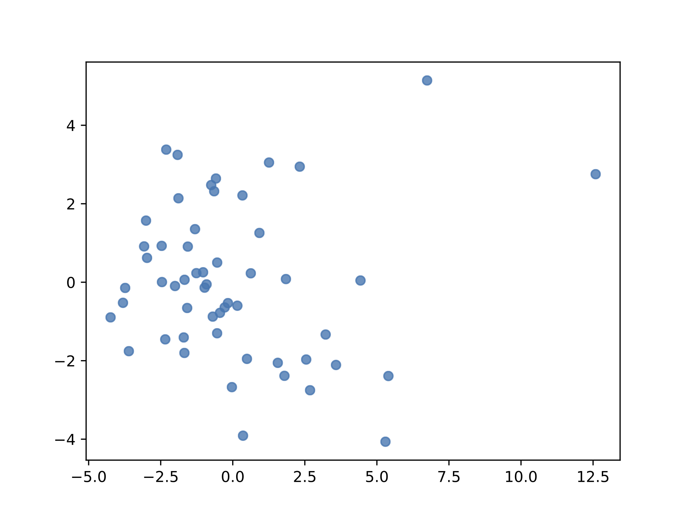
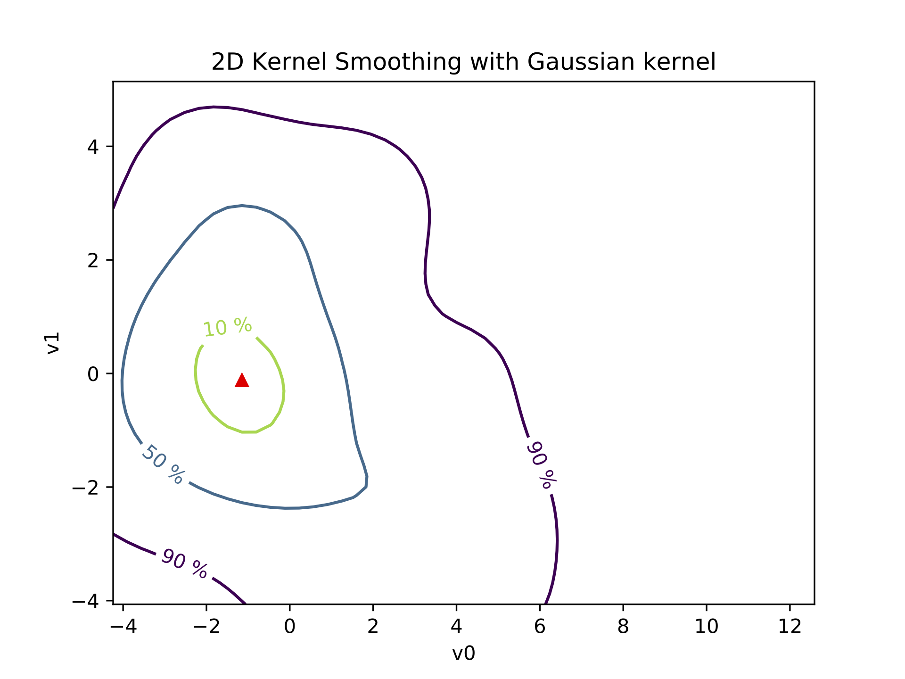

HDR-Boxplot
===========

What is it?
-----------

This project implements the Functional highest density region boxplot technique [Hundman]_.
It is based on `OpenTURNS <http://www.openturns.org>`_ and `scikit-learn <http://scikit-learn.org>`_.

When you have functional data, which is to say: a curve, you will want to answer
some questions such as:

* What is the median curve?
* Can I draw a confidence interval?
* Or, is there any outliers?

This module allows you to do exactly this: 

.. code-block:: python
    
    data = np.loadtxt('data/elnino.dat')
    print('Data shape: ', data.shape)

    hdr_boxplot(data)

The output is the following figure: 

How does it work?
-----------------

Behind the scene, the dataset is represented as a matrix. Each line corresponding
to a 1D curve. This matrix is then decomposed using Principal Components Analysis (PCA).
This allows to represent the data using a finit number of modes, or components.
This compression process allows to turn the functional representation into a
scalar representation of the matrix. In other words, you can visualize each curve
from its components. This is called a bivariate plot:

This visualization exhibit a cluster of points. It indicate that a lot of
curve lead to a common components. The center of the cluster is the mediane curve.
An the more you get away from the cluster, the more the curve is unlikely to be
similar to the other curves.

Using a kernel smoothing technique, the probability density function (PDF) of
the 2D space can be recover. From this PDF, it is possible to compute the density
probability linked to the cluster and plot its contours.

Finally, using these contours, the different quantiles are extracted allong with
the mediane curve and the outliers.

Requirements
------------

The dependencies are: 

- Python >= 2.7 or >= 3.3
- `scikit-learn <http://scikit-learn.org>`_ >= 0.18
- `numpy <http://www.numpy.org>`_ >= 0.10
- `OpenTURNS <http://www.openturns.org>`_ >= 1.8
- `matplotlib <https://matplotlib.org>`_ >= 1.5.3

Acknowledgement
---------------

I am gratefull to the help and support on OpenTURNS Michaël Baudin has provided.

References
----------

.. [Hyndman2009] Rob J Hyndman and Han Lin Shang. Rainb ow plots , bagplots and b oxplots for functional data. Journal of Computational and Graphical Statistics, 19:29-45, 2009
